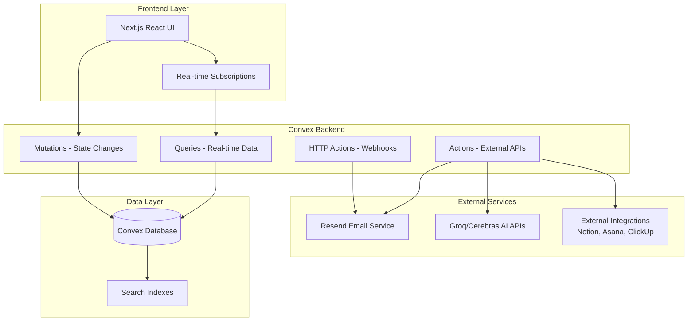

# Design Document

## Overview

InboxZero AI is architected as a modern, serverless email collaboration platform built on Convex's real-time backend infrastructure. The system combines intelligent email processing with seamless team collaboration through a carefully designed architecture that prioritizes real-time updates, scalability, and reliability.

The platform leverages Convex for all backend operations (database, real-time subscriptions, serverless functions), the Convex Resend Component for robust email handling, and AI services (Groq/Cerebras) for intelligent features like summarization and smart replies.

## Architecture

### High-Level System Architecture



### Core Architectural Principles

1. **Real-time First**: All collaborative features use Convex's live queries for instant updates
2. **Serverless Scalability**: Convex handles all scaling concerns automatically
3. **Type Safety**: End-to-end TypeScript with Convex's generated types
4. **Reliability**: Convex Resend Component provides durable email delivery with automatic retries
5. **Security**: Row-level access control and secure API key management

## Components and Interfaces

### Frontend Components

#### Core UI Components

- **InboxView**: Main thread list with real-time updates
- **ThreadView**: Detailed conversation view with messages and collaboration features
- **MessageComposer**: Reply editor with AI integration
- **CommentSection**: Internal team collaboration interface
- **SearchBar**: Full-text search with debouncing
- **AssignmentDropdown**: Team member assignment interface

#### AI Integration Components

- **SummaryBox**: Displays AI-generated thread summaries
- **SmartReplyModal**: Tone selection and AI reply generation
- **PriorityTags**: Visual priority indicators with feedback options

#### Collaboration Components

- **PresenceIndicators**: Real-time user presence display
- **EmojiReactions**: Comment reaction interface
- **TaskCreationSidebar**: External integration forms

### Backend API Structure

#### Convex Queries (Real-time Data Fetching)

```typescript
// Real-time thread list
api.threads.list: (userId: Id<"users">) => Thread[]

// Real-time messages for thread
api.messages.listForThread: (threadId: Id<"threads">) => Message[]

// Real-time comments
api.comments.listForThread: (threadId: Id<"threads">) => Comment[]

// Full-text search
api.threads.search: (query: string, filters: SearchFilters) => Thread[]

// User presence
api.presence.listForThread: (threadId: Id<"threads">) => PresenceInfo[]

// Team members list
api.users.listTeamMembers: (teamId: Id<"teams">) => User[]
```

#### Convex Mutations (State Changes)

```typescript
// Thread management
api.threads.assign: (threadId: Id<"threads">, assigneeId: Id<"users">) => void
api.threads.updatePriority: (threadId: Id<"threads">, priority: Priority) => void

// Message operations
api.messages.create: (threadId: Id<"threads">, content: string) => Message
api.messages.markAsRead: (threadId: Id<"threads">, userId: Id<"users">) => void

// Collaboration features
api.comments.add: (threadId: Id<"threads">, content: string) => Comment
api.comments.addReaction: (commentId: Id<"comments">, emoji: string) => void

// Presence tracking
api.presence.update: (threadId: Id<"threads">) => void
```

#### Convex Actions (External API Integration)

```typescript
// AI services
api.ai.generateSummary: (threadId: Id<"threads">) => string
api.ai.generateReply: (threadId: Id<"threads">, tone: ReplyTone) => string
api.ai.classifyPriority: (messageContent: string) => Priority

// Email sending
api.email.sendReply: (threadId: Id<"threads">, content: string, recipients: string[]) => void

// External integrations
api.integrations.notion.createTask: (threadId: Id<"threads">, taskDetails: TaskDetails) => void
api.integrations.asana.createTask: (threadId: Id<"threads">, taskDetails: TaskDetails) => void
```

#### HTTP Actions (Webhook Handlers)

```typescript
// Email ingestion
api.webhooks.resendInbound: (request: Request) => Response

// Delivery status updates
api.webhooks.resendStatus: (request: Request) => Response
```

## Data Models

### Core Database Schema

```typescript
// Users and Teams
users: {
  _id: Id<"users">,
  authId: string,           // Convex Auth integration
  email: string,
  name: string,
  avatarUrl?: string,
  teamId: Id<"teams">,
  createdAt: number
}

teams: {
  _id: Id<"teams">,
  name: string,
  domain: string,           // Email domain for auto-assignment
  settings: TeamSettings,
  createdAt: number
}

// Email Data
threads: {
  _id: Id<"threads">,
  subject: string,
  teamId: Id<"teams">,
  assigneeId?: Id<"users">,
  priority: "urgent" | "action_required" | "info_only",
  status: "unread" | "read" | "replied" | "closed",
  summary?: string,         // AI-generated summary
  lastMessageAt: number,
  createdAt: number,
  // Email headers for threading
  messageId: string,        // Original Message-ID
  references: string[]      // For reply threading
}

messages: {
  _id: Id<"messages">,
  threadId: Id<"threads">,
  fromEmail: string,
  fromName?: string,
  toEmails: string[],
  ccEmails?: string[],
  bccEmails?: string[],
  subject: string,
  htmlBody?: string,
  textBody?: string,
  isOutbound: boolean,      // true for sent emails
  messageId: string,        // Email Message-ID header
  inReplyTo?: string,       // In-Reply-To header
  sentAt: number,
  // Resend integration
  resendId?: string,        // Resend message ID
  deliveryStatus?: "sent" | "delivered" | "bounced" | "complained"
}

// Collaboration Features
comments: {
  _id: Id<"comments">,
  threadId: Id<"threads">,
  userId: Id<"users">,
  content: string,
  reactions: Array<{
    emoji: string,
    userIds: Id<"users">[]
  }>,
  createdAt: number
}

presence: {
  _id: Id<"presence">,
  userId: Id<"users">,
  threadId: Id<"threads">,
  lastActiveAt: number
}

// External Integrations
tasks: {
  _id: Id<"tasks">,
  threadId: Id<"threads">,
  createdBy: Id<"users">,
  integration: "notion" | "asana" | "clickup",
  externalId: string,
  title: string,
  url?: string,
  createdAt: number
}

// AI and Analytics
emailFeedback: {
  _id: Id<"emailFeedback">,
  threadId: Id<"threads">,
  userId: Id<"users">,
  feedbackType: "priority_correct" | "priority_incorrect" | "summary_helpful" | "summary_unhelpful",
  originalValue: string,
  suggestedValue?: string,
  createdAt: number
}
```

### Database Indexes

```typescript
// Performance indexes
threads: defineTable({...})
  .index("by_team", ["teamId"])
  .index("by_assignee", ["assigneeId"])
  .index("by_last_message", ["lastMessageAt"])
  .searchIndex("search_subject", {
    searchField: "subject",
    filterFields: ["teamId", "priority", "status", "assigneeId"]
  })

messages: defineTable({...})
  .index("by_thread", ["threadId"])
  .index("by_message_id", ["messageId"])
  .searchIndex("search_content", {
    searchField: "textBody",
    filterFields: ["threadId", "isOutbound"]
  })

comments: defineTable({...})
  .index("by_thread", ["threadId"])
  .index("by_user", ["userId"])

presence: defineTable({...})
  .index("by_thread", ["threadId"])
  .index("by_user_thread", ["userId", "threadId"])
```

## Error Handling

### Email Processing Errors

- **Webhook Failures**: Implement idempotent webhook handlers with proper error logging
- **Parsing Errors**: Graceful handling of malformed email content with fallback to raw text
- **Threading Errors**: Fallback to creating new threads when reply association fails

### AI Service Errors

- **API Timeouts**: Implement retry logic with exponential backoff
- **Rate Limiting**: Queue AI requests and respect provider limits
- **Content Filtering**: Handle cases where AI services reject content

### External Integration Errors

- **Authentication Failures**: Clear error messages and re-authentication flows
- **API Unavailability**: Graceful degradation with retry mechanisms
- **Data Validation**: Robust validation before sending data to external services

### Real-time Subscription Errors

- **Connection Drops**: Automatic reconnection with Convex's built-in resilience
- **Permission Errors**: Clear access denied messages with proper error boundaries
- **Data Consistency**: Optimistic updates with rollback on failure

## Testing Strategy

### Unit Testing

- **Convex Functions**: Test all queries, mutations, and actions in isolation
- **React Components**: Component testing with mocked Convex hooks
- **Utility Functions**: Pure function testing for email parsing, formatting, etc.

### Integration Testing

- **Email Flow**: End-to-end testing of email ingestion and sending
- **AI Integration**: Mock AI services for consistent testing
- **External APIs**: Use test environments for Notion, Asana, etc.

### Real-time Testing

- **Multi-client Testing**: Verify real-time updates across multiple browser sessions
- **Presence Testing**: Validate presence indicators and cleanup
- **Collaboration Testing**: Test comment posting and reactions across users

### Performance Testing

- **Database Queries**: Verify index usage and query performance
- **Real-time Subscriptions**: Test with high message volumes
- **AI Response Times**: Monitor and optimize AI service call latency

### Security Testing

- **Access Control**: Verify users can only access their team's data
- **Input Validation**: Test against malicious email content and user input
- **API Security**: Validate webhook signatures and API key protection

### Email Deliverability Testing

- **Spam Testing**: Verify emails don't trigger spam filters
- **Template Rendering**: Test email templates across different clients
- **Delivery Status**: Verify webhook handling for all delivery states

This comprehensive design provides a solid foundation for building InboxZero AI with proper separation of concerns, scalability, and maintainability while leveraging Convex's strengths for real-time collaboration and the Resend Component for reliable email handling.
